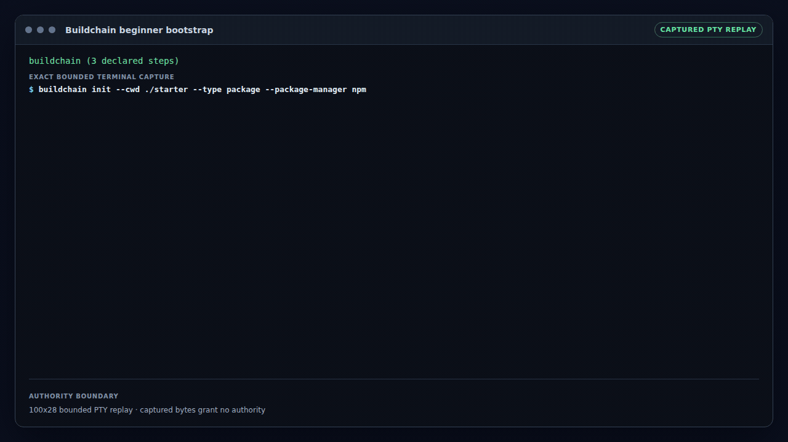

# Buildchain

Development continues on `dev/v4/v4.1`. The package version and published
Release Passport identify source and release state. See
[Code organization](docs/code-organization.md) for the workflow, action,
JavaScript and Rust implementation layers.

The retained animation below demonstrates an older initializer. For the current
schema-2 caller pair, follow the [Golden Path](docs/getting-started.md).

<!-- buildchain-auditable-demo:start -->
## Buildchain beginner bootstrap

[](docs/evidence/auditable-demo/f1e764e881f4d4d70f30cc84cbaaa638e50b59fd4a8578af9769725b7b28b0f2/beginner-bootstrap/public-evidence.json)

Animation scenario:

```text
$ buildchain init --cwd ./starter --type package --package-manager npm
$ buildchain layout --cwd ./starter --json
$ buildchain version
```

Native renditions: [1080p MP4](docs/evidence/auditable-demo/f1e764e881f4d4d70f30cc84cbaaa638e50b59fd4a8578af9769725b7b28b0f2/beginner-bootstrap/demo.mp4) · [1080p WebM](docs/evidence/auditable-demo/f1e764e881f4d4d70f30cc84cbaaa638e50b59fd4a8578af9769725b7b28b0f2/beginner-bootstrap/demo.webm) · [720p MP4](docs/evidence/auditable-demo/f1e764e881f4d4d70f30cc84cbaaa638e50b59fd4a8578af9769725b7b28b0f2/beginner-bootstrap/demo-720p.mp4) · [720p WebM](docs/evidence/auditable-demo/f1e764e881f4d4d70f30cc84cbaaa638e50b59fd4a8578af9769725b7b28b0f2/beginner-bootstrap/demo-720p.webm)

[Static poster / reduced-motion fallback](docs/evidence/auditable-demo/f1e764e881f4d4d70f30cc84cbaaa638e50b59fd4a8578af9769725b7b28b0f2/beginner-bootstrap/poster.png)

<details>
<summary>Evidence and claim boundary</summary>

This exact standalone-binary scenario proves deterministic local bootstrap behavior only; it does not grant release, repository, network, or production authority.

[Release Passport](docs/evidence/auditable-demo/f1e764e881f4d4d70f30cc84cbaaa638e50b59fd4a8578af9769725b7b28b0f2/beginner-bootstrap/release-passport.json) · [auditable evidence](docs/evidence/auditable-demo/f1e764e881f4d4d70f30cc84cbaaa638e50b59fd4a8578af9769725b7b28b0f2/beginner-bootstrap/public-evidence.json)

</details>
<!-- buildchain-auditable-demo:end -->

<!-- buildchain:badges:start -->

[](https://github.com/kungfu-systems/buildchain/releases/latest/download/buildchain.release.json)
[](https://github.com/kungfu-systems/buildchain/releases/latest/download/buildchain.release.json)
[](https://github.com/kungfu-systems/buildchain/releases/latest/download/buildchain.release.json)
[](https://github.com/kungfu-systems/buildchain/releases/latest/download/buildchain.release.json)
[](https://github.com/kungfu-systems/buildchain/releases/latest/download/buildchain.release.json)
[](https://github.com/kungfu-systems/buildchain/blob/HEAD/LICENSE)
[](https://github.com/kungfu-systems/buildchain/releases/latest/download/buildchain.release.json)
[](https://github.com/kungfu-systems/buildchain/actions/workflows/buildchain.yml)
<!-- buildchain:badges:end -->

Buildchain Release Passport is a mature product release record for artifacts
that users or agents depend on.

Buildchain by Kungfu uses GitHub as the execution and trust substrate: protected
refs, reviewed promotion PRs, exact tags, GitHub Releases, npm Trusted
Publishing, and machine-readable evidence. Its job is to turn release intent
into an auditable product record, not to ask a repository to migrate away from
its existing CI.

The same mechanism releases Buildchain itself.

## Choose Your Path

| You are...                             | Start here                                                 | You will get...                                                                                                      |
| -------------------------------------- | ---------------------------------------------------------- | -------------------------------------------------------------------------------------------------------------------- |
| adopting Buildchain for the first time | [Golden Path](docs/getting-started.md)                     | an exact install, project declaration, validated config, reusable workflow, release dry-run, and Passport inspection |
| looking up a CLI command               | [Generated CLI Reference](docs/cli-reference.md)           | governed syntax, options, aliases, and side-effect-free help paths                                                   |
| writing JavaScript automation          | [Generated Node API Reference](docs/node-api-reference.md) | every public subpath and symbol with source-derived signatures and behavior boundaries                               |
| operating an advanced build or release | [Documentation Map](docs/MAP.md)                           | capability-, intent-, and maturity-based navigation to normative contracts                                           |

Production release operators should also read the
[release governance guide](docs/release-governance.md).

The Golden Path is the beginner lane. Advanced workflow, signing, publishing,
and governance manuals remain separate so a first-time consumer does not need
to understand the entire release control plane before reaching a valid local
configuration.

## Where Buildchain sits in the Agent Supply Chain

Buildchain binds a product's declarations to the exact source cut, build,
artifacts, checks, and promotion record that produced a release. In the wider
Agent Supply Chain it sits between KFD-3 product discovery and KFD-2
purpose-bound assessment:

```text
KFD-3 declaration -> Buildchain exact-artifact evidence -> KFD-2 assessment
```

Buildchain can prove that a declared claim and an exact artifact remain
consistent, or fail/downgrade when their evidence drifts. It does not invent
the product fact, decide whether a receiver should trust it for a purpose,
certify every platform, or prove external adoption. Receivers and downstream
KFD-2 assessors retain the admission decision and residual risk.

To evaluate the layer, inspect a release's `buildchain.release.json` and
`artifact-evidence.json`, verify them with the CLI, and report missing product
or protocol evidence through the repository issue tracker.

## Install and Verify

New repository adopters should follow the [15–30 minute Golden Path](docs/getting-started.md).
The commands below are the shorter verification-only route for an existing
consumer.

For v4, use the published npm package and verify the release passport before
trusting release evidence:

```bash
curl -LO https://github.com/kungfu-systems/buildchain/releases/download/v4.0.0/buildchain.release.json
curl -LO https://github.com/kungfu-systems/buildchain/releases/download/v4.0.0/artifact-evidence.json
npx @kungfu-tech/buildchain@4.0.0 verify release-passport buildchain.release.json
npx @kungfu-tech/buildchain@4.0.0 version
```

The v4.0.0 release publishes evidence assets and platform archives through the
same protected promotion transaction.
The names below describe the optional archive contract used by legacy release
lines:

- `buildchain-x86_64-unknown-linux-gnu.tar.gz`
- `buildchain-aarch64-apple-darwin.tar.gz`
- `buildchain-x86_64-pc-windows-msvc.zip`
- `checksums.txt`
- `buildchain.release.json`
- `artifact-evidence.json`
- `product-mechanism.json`
- `impact.json`
- `agent-index.json`
- `check-report.json`
- `llms.txt`
- `buildchain-release-bundle.tar.gz`
- `buildchain-release-bundle.json`

Loose top-level `buildchain` and `buildchain.exe` assets are intentionally not
published. The executable lives inside each platform archive, which prevents
Linux and macOS artifacts from overwriting each other in a merged release lane.

For npm consumers:

```bash
npm install -D @kungfu-tech/buildchain
npx buildchain version
npx buildchain doctor --json
```

The npm package is also the Buildchain toolkit. Use the command when a workflow
or shell step needs an executable; use the ESM APIs directly from JavaScript
build scripts. JavaScript callers should import the package instead of spawning
the CLI or unpacking the standalone binary:

```js
import {
  createBuildchainLogger,
  verifyBuildchainLogEvents,
} from "@kungfu-tech/buildchain/logging";

const logger = createBuildchainLogger({
  path: ".buildchain/logs/native-build.jsonl",
  source: "user",
  component: "native-build",
});

await logger.span("native.compile", { phase: "build" }, async () => {
  await compileNativeTargets();
});

const report = verifyBuildchainLogEvents({
  path: logger.path,
  requireEvents: ["native.compile.start", "native.compile.end"],
});
```

The package also ships `dist/site/` as the Buildchain-owned fact source for
`buildchain.libkungfu.dev`.

Repositories can also generate README status badges from Buildchain-owned facts
instead of hand-maintaining badge Markdown:

```bash
buildchain badges bundle --check
buildchain badges bundle --write
buildchain badges readme --check
buildchain badges readme --write
```

## Project Governance

- [`LICENSE-POLICY.md`](LICENSE-POLICY.md) explains the Apache-2.0 project
  license, DCO-based contributions, and third-party notice boundary.
- [`TRADEMARK.md`](TRADEMARK.md) explains official project marks and fork
  identity boundaries.
- [`ACCEPTABLE_USE.md`](ACCEPTABLE_USE.md) explains acceptable use of official
  services and maintainer-operated infrastructure.
- [`PROVIDER_COMPLIANCE.md`](PROVIDER_COMPLIANCE.md) explains the official
  posture for GitHub, npm, cloud, credential, release evidence, and other
  provider integrations.
- [`SECURITY.md`](SECURITY.md) explains private vulnerability reporting.

Native build consumers can import the diagnostics toolkit instead of copying
repository-local probes:

```js
import {
  collectBuildchainDiagnostics,
  collectRunnerDiagnostics,
  writeDiagnosticsArtifact,
} from "@kungfu-tech/buildchain/diagnostics";

writeDiagnosticsArtifact(".buildchain/artifacts/diagnostics.json", {
  contract: "consumer-build-diagnostics",
  buildchain: collectBuildchainDiagnostics({ cwd: process.cwd() }),
  runner: collectRunnerDiagnostics(),
});
```

## Use Buildchain

In an existing npm product with a versioned `package.json` and build/check scripts:

```bash
pnpm add -D --save-exact @kungfu-tech/buildchain
pnpm exec buildchain init --type npm --package-manager pnpm
pnpm exec buildchain validate --require-version-state
pnpm exec buildchain doctor --json
```

Use `--type binary` for a CMake product or `--type paper` for an existing PDF
product. The initializer writes the shared caller pair and product declarations;
edit the TOML to match your product's build, verification and artifact paths.

To create Paper source as well as the shared configuration:

```bash
pnpm exec buildchain paper scaffold \
  --package @kungfu-tech/paper-example \
  --repository kungfu-systems/paper-example
pnpm exec buildchain paper scaffold \
  --package @kungfu-tech/paper-example \
  --repository kungfu-systems/paper-example --write
pnpm exec buildchain paper preflight --offline
pnpm exec buildchain paper status
```

Scaffolding first shows the planned files; `--write` creates them. Paper products
publish PDFs as GitHub Release assets through the same pipeline as other products.
See [Paper products and migration](docs/publication-artifacts.md) for source
prerequisites and preservation of historical publication records.

After one-time repository/provider setup, commit your product and generated
configuration and open a protected channel PR. Buildchain handles delivery and
publication. Recover an interrupted operation by selecting its exact attempt in
`buildchain-recover.yml`. npm Trusted Publishing authenticates hosted npm releases.

Product commands can use pnpm, npm, yarn, pip, Conan, CMake, Make or repository
build scripts. They produce and verify product artifacts; the published runtime
owns release orchestration and its evidence.

## Consumer workflow contract

New consumers use the same two generated files:

- `.github/workflows/buildchain.yml` calls `public-ops-pipeline.yml@v4`.
- `.github/workflows/buildchain-recover.yml` calls `public-ops-recover.yml@v4`.

Declare npm packages, binary archives or Paper PDFs in
`.buildchain/buildchain.toml`. Their install, build and verification commands
remain product code. Open the appropriate protected channel PR to request a
release. The runtime manages publication, provider readback and completion.
Recovery takes an exact attempt and, when needed, one temporary repaired runtime.

The [workflow catalog](docs/workflow-catalog.md) distinguishes the two public
entries from internal components. New integrations declare products in TOML and
use these entries for release orchestration.
The three [standard examples](templates/minimal-consumer/) share identical caller
bytes; their TOML and product source differ. Tool-maintained locks bind the
published runtime. Existing npm Trusted Publishing continues to authenticate
publication in the hosted workflow.

Existing consumers can retain the registered historical workflow paths and their
schema-1 product configuration. See [Compatible upgrades](docs/getting-started.md#migrating-old-callers)
for the supported interfaces and validation boundary.

## Release Model

Buildchain treats a reviewed branch merge as release intent:

| Merge path                              | Meaning                                                | Exact tag        | Floating refs                                        |
| --------------------------------------- | ------------------------------------------------------ | ---------------- | ---------------------------------------------------- |
| `dev/vX/vX.Y -> alpha/vX/vX.Y`          | publish the next testable alpha for a minor line       | `vX.Y.Z-alpha.N` | `vX.Y-alpha`, `alpha/vX/vX.Y`, `dev/vX/vX.Y`         |
| `alpha/vX/vX.Y -> release/vX/vX.Y`      | publish production for that minor line                 | `vX.Y.Z`         | `vX.Y`, usually `vX`, `release/vX/vX.Y`              |
| `release/vX/vX.Y -> publish-gate/major` | publish the next major from a reviewed production line | `v(X+1).0.0`     | `v(X+1)`, `v(X+1).0`, new dev/alpha/release branches |

Exact tags are immutable. Floating channel tags and branches are machine-updated
by Buildchain and must remain writable by the release authority.

After a production release, Buildchain prepares the next alpha source commit for
the same minor line. That keeps production consumers pinned to the production
passport while development can continue on the next testable patch.

`publish-gate/major` is not an active development trunk. It is a reviewed
promotion gate used when maintainers decide that the next production release
should open a new major line.

## Toolkit Observability

Buildchain includes a logging toolkit for release and build steps. Inside
JavaScript build code, prefer the package API:

```js
import { createBuildchainLogger } from "@kungfu-tech/buildchain/logging";

const logger = createBuildchainLogger({ source: "user", component: "conan" });
logger.mark("conan.profile.ready", { phase: "configure" });
await logger.span("conan.install", { phase: "dependencies" }, runConanInstall);
```

In workflows or shell scripts, use the equivalent CLI:

```bash
buildchain mark --event native.configure --phase configure --component cmake
buildchain span --event native.build --phase build -- cmake --build build
buildchain log summary --json
buildchain verify observability-log .buildchain/logs/events.jsonl --min-events 4
```

Every event records a timestamp. `span` records duration. The API form can be
imported from repository scripts so heavy builds can mark phases from inside
their own code.

## Site Fact Source

`@kungfu-tech/buildchain` publishes `dist/site/`:

- `buildchain-site.json`
- `site-manifest.json`
- `page-registry.json`
- `cli-registry.json`
- `workflow-registry.json`
- `release-model.json`
- `artifact-schemas.json`
- `product-mechanism.json`
- `release-provenance.json`
- `agent-index.json`

`buildchain.libkungfu.dev` should render from these package-owned facts, then
layer presentation around them. The site should not hand-write Buildchain's
current release mechanics. `page-registry.json` is the complete markdown page
source for the public site: README homepage content, all packaged `docs/*.md`
manuals, action READMEs, the Node API package overview, and fixture guides.

## Homepage Content Contract

This README is also the homepage text source for `buildchain.libkungfu.dev`.
When a site repository consumes the `@kungfu-tech/buildchain` npm package, it
should use the generated `dist/site/buildchain-site.json` homepage fields
instead of parsing this README or maintaining separate homepage copy.

The first screen should be derived from:

- Page identity: the top-level heading.
- Lead: the opening paragraph that defines Buildchain Release Passport.
- Trust signal: the start of `Install and Verify`, especially passport-first
  binary verification.
- Use signal: the start of `Use Buildchain`, especially the shared normal and recovery
  workflow callers.

The package-owned site bundle exposes ordered `homepage.sections`,
`homepage.displayPlan`, `homepage.rendererContract`, and a complete
`pages` collection mirrored from `page-registry.json`. A site renderer may adapt
layout, navigation, typography, examples, and visual assets, but it should not
maintain separate wording for Buildchain's release mechanics, workflow surface,
operation manuals, Node API overview, fixture guides, or release-passport trust
model. Renderer-contract text is machine/implementation metadata, not ordinary
homepage content.

## Local Verification

```bash
corepack enable pnpm
pnpm install --frozen-lockfile
pnpm run generate:site
pnpm run check
npm pack --dry-run --json --registry=https://registry.npmjs.org/
```

## Read Next

- [Install and verify](docs/install.md)
- [Documentation map](docs/MAP.md)
- [Product mechanism](docs/product-mechanism.md)
- [Release Passport and binary distribution](docs/release-passport.md)
- [GitHub governance authority](docs/github-governance-authority.md)
- [GitHub-native Linux artifact attestation](docs/github-artifact-attestation.md)
- [Binary distribution details](docs/binary-distribution.md)
- [Toolkit observability](docs/toolkit-observability.md)
- [Site bundle contract](docs/site-bundle-contract.md)
- [Lifecycle protocol](docs/lifecycle-protocol.md)
- [Reusable build surface](docs/reusable-build-surface.md)
- [Shifu Gate profile orchestration](docs/shifu-gate-profiles.md)
- [Release candidate passport](docs/release-candidate.md)
- [Consumer issue reporting](docs/consumer-issue-reporting.md)
- [Publish transaction](docs/publish-transaction.md)
- [Declarative release-tail contract](docs/release-tail-contract.md)
- [v4 declarative release-tail migration](docs/v4-declarative-release-tail-migration.md)
- [Release governance](docs/release-governance.md)
