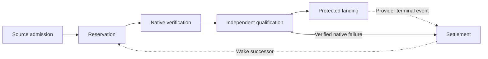

# Dev delivery orchestration

`public-ops-dev-auto-merge.yml` orchestrates six owned delivery nodes. The
published `public-ops-dev-auto-merge.yml` entry remains its generated compatibility
projection, with the same inputs, outputs, job identities, concurrency and
permissions. Node ownership and the orchestration size budget are declared in
[`architecture/dev-delivery-orchestration.json`](../architecture/dev-delivery-orchestration.json).

| Node                | Owning composite                                              | Result and continuation                                                                                                                                                                 |
| ------------------- | ------------------------------------------------------------- | --------------------------------------------------------------------------------------------------------------------------------------------------------------------------------------- |
| Source admission    | [source](../actions/dev-delivery/candidate/admit/action.yml)   | Resolve one runtime SHA; check exact source eligibility; produce the Source Qualification Proof or an explicit failed qualification outcome.                                            |
| Reservation         | [reserve](../actions/dev-delivery/candidate/reserve/action.yml) | Submit the candidate and select or recover its exact Warrant. A different active owner receives a handoff; an already-qualified owner skips native execution.                           |
| Native verification | [native](../actions/dev-delivery/native/dispatch/action.yml)   | Execute or reuse native proof, independently seal its transfer, and maintain the durable lease in three distinct hosted jobs.                                                           |
| Qualification       | [qualify](../actions/dev-delivery/candidate/qualify/action.yml) | Read back provider job boundaries and heartbeat continuity; validate proof and current source/base; atomically qualify the same Warrant.                                                |
| Landing             | [land](../actions/dev-delivery/queue/land/action.yml)       | Recheck admission and enqueue or directly merge according to the existing policy. Publish artifacts and enforce the final result even after a predecessor fails.                        |
| Settlement          | [settle](../actions/dev-delivery/warrant/settle/action.yml)   | Settle independently verified native failure, or process a later provider terminal event through `public-ops-warrant-close.yml`. Clear only the exact authority and wake its successor. |

The six nodes describe ownership, not six new runner allocations. Source and
reservation share the existing admission job. Qualification, native-failure
settlement and landing share the existing fresh provider finalizer. Native
execution, sealing and heartbeat retain their separate hosted jobs and original
provider-visible names. Composite actions do not provide runner or credential
isolation themselves.

## Contracts and authority

Each node receives `request-json`, the typed workflow inputs serialized with
`toJSON(inputs)`. Nodes use `fromJSON` to retain boolean and numeric semantics;
`false` must never become a truthy string. Dependent jobs also pass `needs-json`
with exact admitted outputs and job results. Within a job, explicit scalar
ports carry predecessor proof roots and step outcomes. These internal ports are
listed in the ownership contract; no node serializes the entire step context or
receives secrets inside the request envelope.

The workflow first checks out its own implementation using
`job.workflow_repository` and `job.workflow_sha`, without persisted credentials.
Its local composites therefore come from the exact workflow definition, including
when another repository calls it. Separately, source admission resolves the
requested Buildchain runtime once. All later runtime checkouts continue using
that admitted SHA and its rooted selection readback. The implementation checkout
never replaces the existing runtime selection authority.

The native node's literal `phase` is `execute`, `seal`, or `heartbeat`, selected
by the fixed owning job. Only the heartbeat invocation receives a provider write
token. Native and seal retain their original read-only job permissions and
credentialless execution contracts. The settlement node's `phase` is
`native-failure` in the verified finalizer or `terminal` in the asynchronous
close workflow. A queue admission cannot select terminal settlement by itself.

## Failure and recovery

The original `off`, `shadow`, `required`, dry-run, universal-bootstrap,
proof-reuse, legacy handoff and deferred-landing paths remain in their owning
nodes. A node boundary does not grant new retry or cleanup authority. Resume
continues to require the exact candidate, live fence and verified reusable proof
under the [Warrant contract](dev-delivery-warrant.md).

Reservation and landing receive the parent job's `job.status == 'success'` result explicitly. Their reporting
runs unconditionally, but mutation cannot run after an earlier node has
failed. The final result still checks native execution, sealing, heartbeat,
qualification, exact failure settlement and targeted admission separately.
Successful enqueue remains an intermediate state: the terminal workflow is
invoked only when terminal provider evidence is available, possibly in another
workflow run.

## Verification

`tests/dev-delivery-orchestration.test.mjs` expands only reachable composite
calls, resolves their predecessor ports, and compares the complete operation
sequence against hashes of the protected pre-refactor workflows. Normalization
ignores only YAML separator blank lines, explicit default Bash and optional expression delimiters
on conditions. Literal body whitespace is preserved. Commands, guards, artifacts, public contracts and job boundaries
remain part of the comparison. Negative tests change a provider command and
remove a proof guard to prove that the conservation check rejects both.

Existing source-admission and credential-boundary tests inspect that expanded
call graph. Additional checks enforce six owned nodes, bounded orchestration,
exact implementation checkout, phase routing, token separation and unconditional
failure reporting. This static and unit evidence does not claim that every
provider failure or cancellation has been reproduced in a hosted run.

The node contract also caps each composite and their combined line count, so
extracting steps cannot hide an unbounded implementation behind a thin entry.
Release topology reads the same reachable call graph; facade regeneration
preserves the node-owned source even with `--fresh`, while frozen terminal
facade semantics remain verified.
