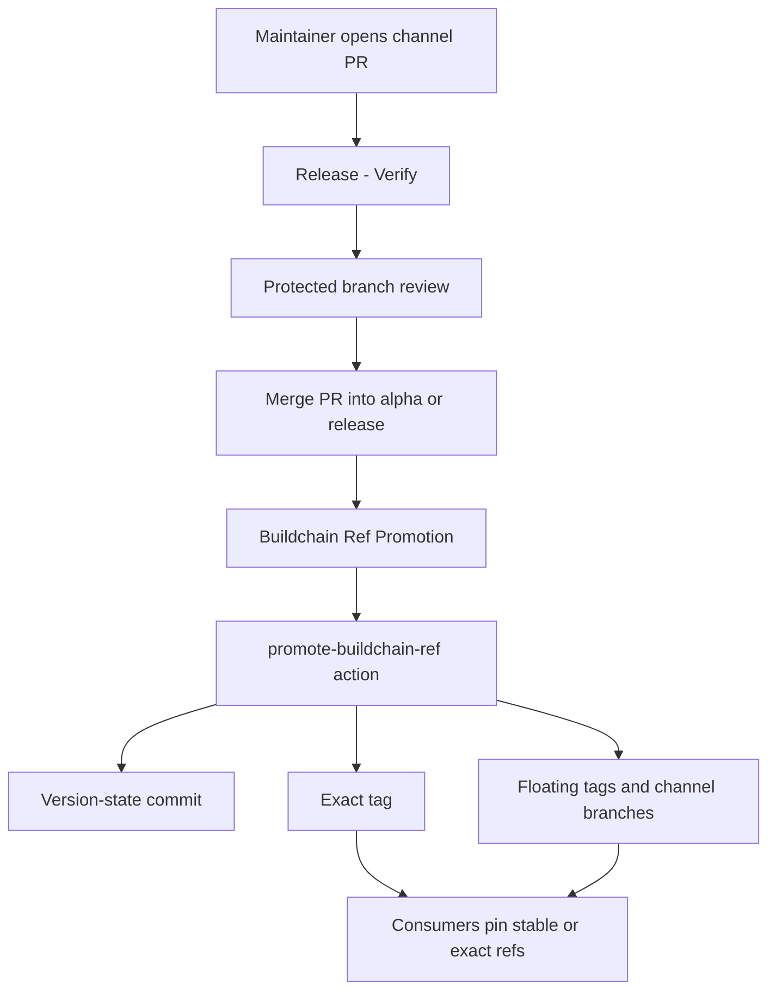
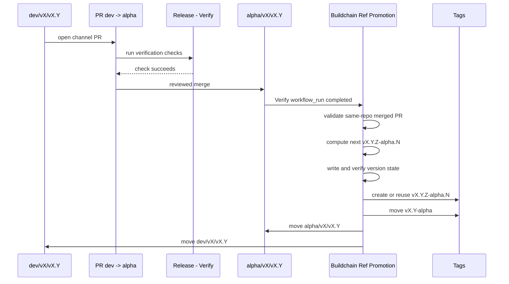
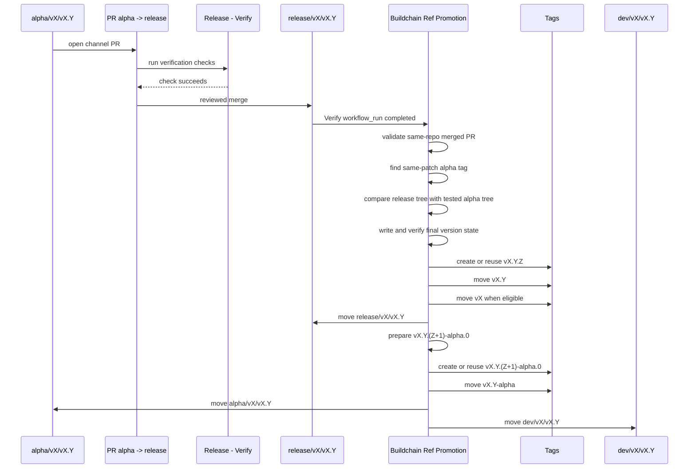
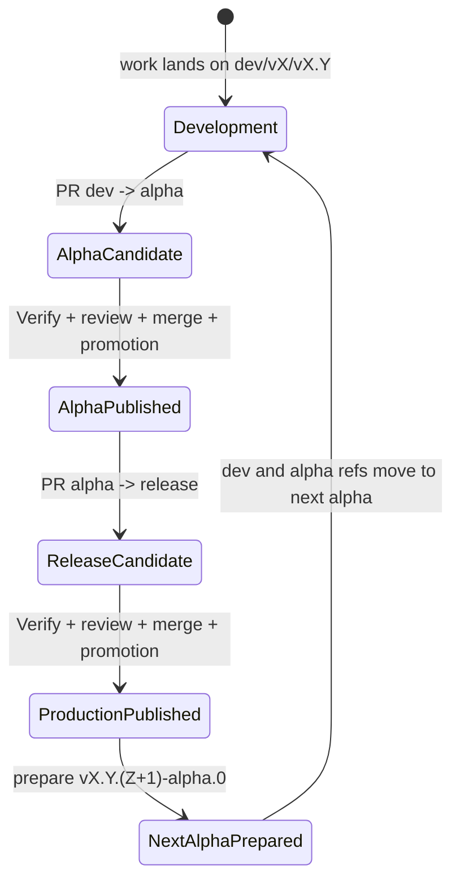

# Release Flow Diagrams

This document describes the Buildchain v1 branch, tag, and version-state flow.
See [Release governance](release-governance.md) for the design rationale.

## Architecture



Buildchain treats the PR merge as release intent and the promotion action as the
only component allowed to turn that intent into release refs.

## Ref State

| Ref kind | Example | Mutability | Purpose |
| --- | --- | --- | --- |
| Development branch | `dev/v1/v1.0` | moves | next source state for a minor line |
| Alpha branch | `alpha/v1/v1.0` | moves | latest test state for a minor line |
| Release branch | `release/v1/v1.0` | moves | latest production state for a minor line |
| Exact alpha tag | `v1.0.5-alpha.0` | immutable | audit ref for one tested prerelease |
| Exact release tag | `v1.0.4` | immutable | audit ref for one production release |
| Floating alpha tag | `v1.0-alpha` | moves | latest test channel for a minor line |
| Floating minor tag | `v1.0` | moves | latest production patch on a minor line |
| Floating major tag | `v1` | moves | selected stable major entrypoint |

## Alpha Promotion



Result:

```text
vX.Y.Z-alpha.N
vX.Y-alpha
alpha/vX/vX.Y
dev/vX/vX.Y
```

all point at the generated alpha version-state commit.

## Release Promotion



Result:

```text
vX.Y.Z
vX.Y
vX
release/vX/vX.Y
```

point at the production version-state commit, while:

```text
vX.Y.(Z+1)-alpha.0
vX.Y-alpha
alpha/vX/vX.Y
dev/vX/vX.Y
```

point at the next alpha version-state commit.

## State Machine



The same minor line can loop through this state machine many times.

## Version Examples

Assume `v1.0.4-alpha.0` has been tested and a maintainer merges
`alpha/v1/v1.0 -> release/v1/v1.0`.

Buildchain should produce:

```text
v1.0.4                  exact production tag
v1.0                    floating minor tag
v1                      floating major tag when v1.0 is the selected major line
release/v1/v1.0         production channel branch
```

It should also prepare:

```text
v1.0.5-alpha.0          exact next alpha tag
v1.0-alpha              floating alpha tag
alpha/v1/v1.0           alpha channel branch
dev/v1/v1.0             development channel branch
```

This is expected behavior. A production release closes one patch and opens the
next test patch on the same minor line.

## Failure Boundaries

Promotion should stop before moving refs when:

- the run is a non-dry-run manual dispatch;
- the expected same-repository PR cannot be found;
- the PR was not merged;
- the branch pair is not a valid channel path;
- the required status check did not pass;
- a release tree does not match the same-patch alpha tag tree;
- version-state verification fails;
- a required exact tag already exists at a different commit.

These failures are intentional. They protect consumers from refs that look
released but do not have a complete evidence chain.
