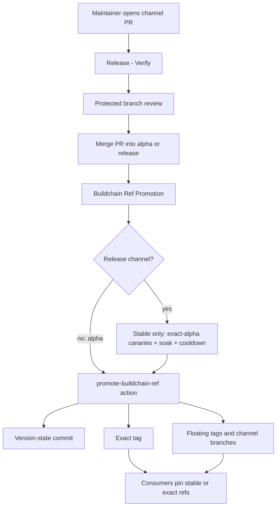
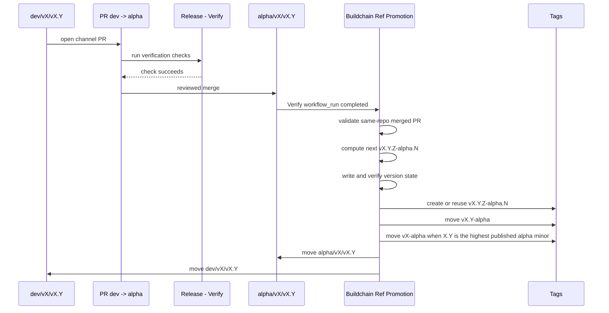
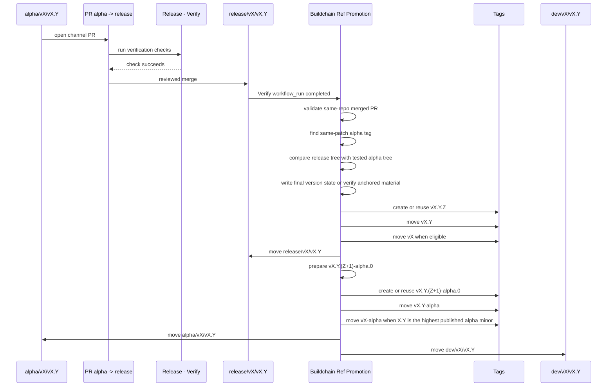
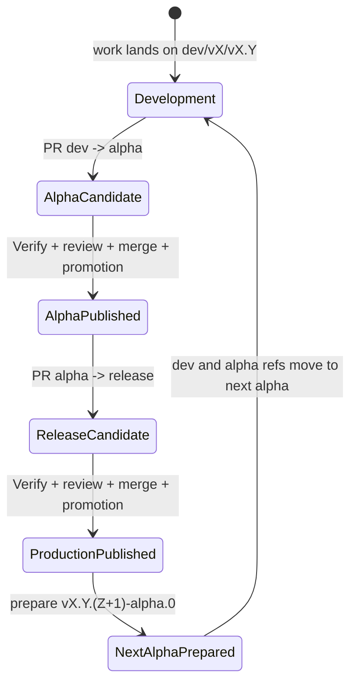
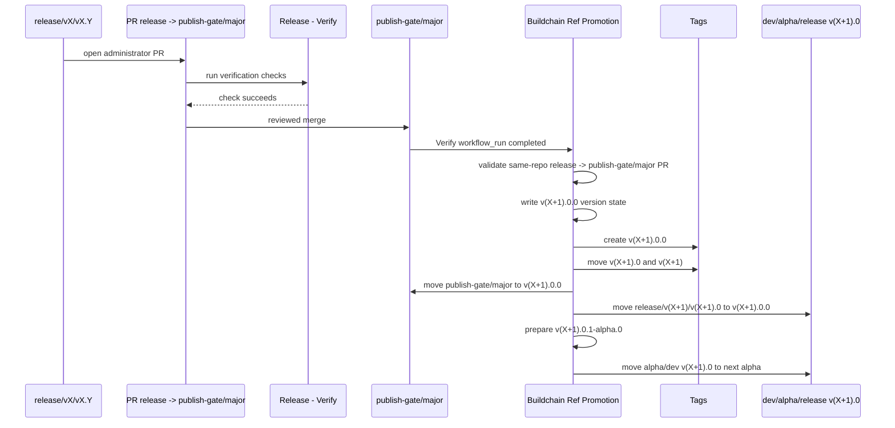

# Release Flow Diagrams

This document describes the Buildchain v2 branch, tag, and version-state flow.
See [Release governance](release-governance.md) for the design rationale.

## Architecture



Buildchain treats the PR merge as release intent and the promotion action as the
only component allowed to turn that intent into release refs.

`StableGate` applies only to Buildchain's release channel. Alpha and train
iteration bypass it. See [Stable Release Throttle And Canary Gate](release-governance.md#stable-release-throttle-and-canary-gate)
for the versioned policy and evidence contract.

## Ref State

| Ref kind | Example | Mutability | Purpose |
| --- | --- | --- | --- |
| Development branch | `dev/v2/v2.0` | moves | next source state for a minor line |
| Alpha branch | `alpha/v2/v2.0` | moves | latest test state for a minor line |
| Release branch | `release/v2/v2.0` | moves | latest production state for a minor line |
| Major gate branch | `publish-gate/major` | moves | reviewed administrator gate for publishing the next major |
| Exact alpha tag | `v2.0.3-alpha.0` | immutable | audit ref for one tested prerelease |
| Exact release tag | `v2.0.2` | immutable | audit ref for one production release |
| Floating alpha tag | `v2.0-alpha` | moves | latest test channel for a minor line |
| Floating major alpha tag | `v2-alpha` | moves | latest test channel on the highest published alpha minor for a major line |
| Floating minor tag | `v2.0` | moves | latest production patch on a minor line |
| Floating major tag | `v2` | moves | selected stable major entrypoint |

## Ref Protection Contract

Repository rulesets must distinguish immutable evidence refs from mutable
channel refs.

Protect exact release and alpha tags as immutable evidence:

```text
refs/tags/v*.*.*
```

Do not apply immutable-tag rulesets to every `refs/tags/v*` ref. Buildchain
must be able to update floating channel tags such as `v2`, `v2.0`, `v2.0-alpha`,
and `v2-alpha` after the exact tag and publish evidence are valid. A ruleset that
matches all `v*` tags also matches floating tags, so release finalization can
fail with GitHub protected-ref errors even though the exact release tag and
published artifacts are already durable.

The intended governance split is:

- exact tags such as `v2.0.14` and `v2.0.15-alpha.0` are immutable audit refs;
- floating tags such as `v2`, `v2.0`, `v2.0-alpha`, and `v2-alpha` are mutable channel refs
  owned by the Buildchain promotion token;
- protected branches still require reviewed channel PRs before Buildchain can
  move any exact or floating release refs.

## Opening a Minor Line

New minor lines should be opened through Buildchain instead of hand-created
branches. The reusable entrypoint is the `Release Line Bootstrap` workflow. It
defaults to dry-run so maintainers can inspect the planned refs, protection
contract, initial version, and first alpha PR before any mutation.

The workflow is backed by the CLI command:

```bash
buildchain release line open \
  --major 2 \
  --minor 10 \
  --source-ref release/v2/v2.9 \
  --json
```

When the workflow is run with `apply=true`, Buildchain:

- writes the initial version-state commit, such as `2.10.0-alpha.0`;
- creates `dev/v2/v2.10` from that commit;
- creates `alpha/v2/v2.10` and `release/v2/v2.10` from the selected source ref;
- applies branch protection with one approving review and the configured
  required status check; dev starts strict, while alpha and release also require
  the pair-specific `verify` aggregate without a source-up-to-date ancestry loop;
- switches the repository default branch to the new dev line when requested;
- opens the first `dev/v2/v2.10 -> alpha/v2/v2.10` channel PR when requested.

This makes minor-line creation a single audited operation. The channel PR still
goes through the normal verify/review/promotion path before an alpha is
published.

## Alpha Promotion



Result:

```text
vX.Y.Z-alpha.N
vX.Y-alpha
vX-alpha when X.Y is the highest published alpha minor
alpha/vX/vX.Y
dev/vX/vX.Y
```

all point at the generated alpha version-state commit.

## Release Promotion



Result:

```text
vX.Y.Z
vX.Y
vX
release/vX/vX.Y
```

point at the production version-state commit, while:

```text
vX.Y.(Z+1)-alpha.0
vX.Y-alpha
vX-alpha when X.Y is the highest published alpha minor
alpha/vX/vX.Y
dev/vX/vX.Y
```

point at the next alpha version-state commit.

## State Machine



The same minor line can loop through this state machine many times.

## Version Examples

Assume `v2.0.2-alpha.1` has been tested and a maintainer merges
`alpha/v2/v2.0 -> release/v2/v2.0`.

Buildchain should produce:

```text
v2.0.2                  exact production tag
v2.0                    floating minor tag
v2                      floating major tag when v2.0 is the selected major line
release/v2/v2.0         production channel branch
```

It should also prepare:

```text
v2.0.3-alpha.0          exact next alpha tag
v2.0-alpha              floating alpha tag
v2-alpha                floating major alpha tag when v2.0 is the highest published alpha minor
alpha/v2/v2.0           alpha channel branch
dev/v2/v2.0             development channel branch
```

This is expected behavior. A production release closes one patch and opens the
next test patch on the same minor line.

## Major Gate Promotion



`publish-gate/major` is intentionally not an active source branch. It is the PR
target for the administrator's "publish the next major" decision. The older
`major-gate` name is a compatibility alias only.

## Failure Boundaries

Promotion should stop before moving refs when:

- the run is a non-dry-run manual dispatch;
- the expected same-repository PR cannot be found;
- the PR was not merged;
- the branch pair is not a valid channel path;
- the required status check did not pass;
- a release tree does not match the same-patch alpha tag tree, except for the
  declared anchored/manual version files and anchor manifest that
  `lifecycle.verify` or `verification-command` validates;
- version-state verification fails;
- a required exact tag already exists at a commit unrelated to the active
  transaction or finalized channel head.

These failures are intentional. They protect consumers from refs that look
released but do not have a complete evidence chain.

During transaction finalization recovery, the current channel head may be a
generated version-state merge commit. Buildchain validates that the durable
transaction version, exact tag, evidence, and release material match, and that
the current target ref contains or corresponds to the recorded
`release_material_sha`. It must then tolerate exact tags, dev refs, or alpha
refs that have already moved and continue filling any missing floating tags
before writing the transaction state as `complete`.
