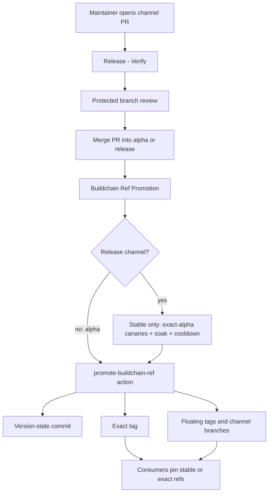
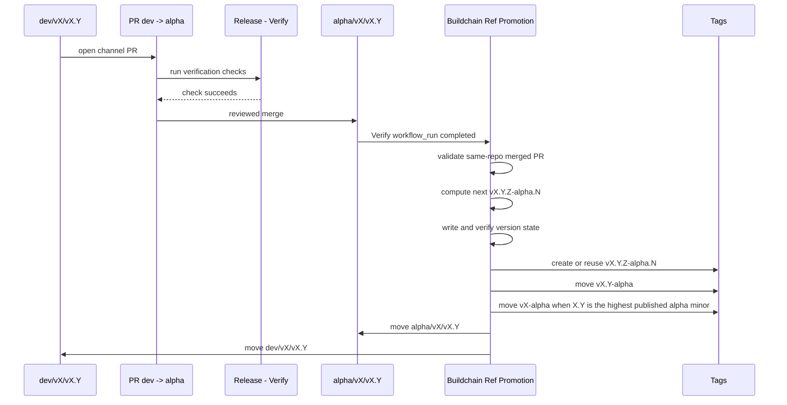
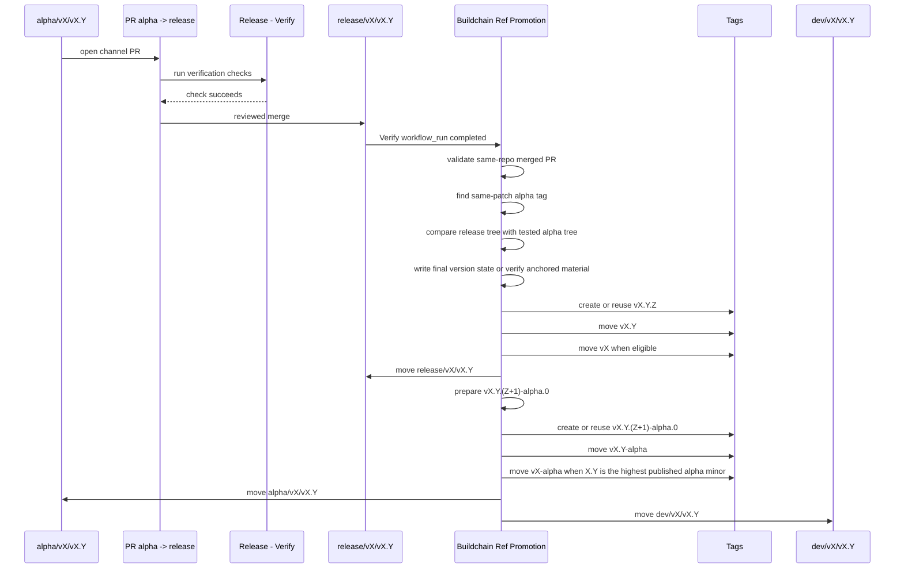
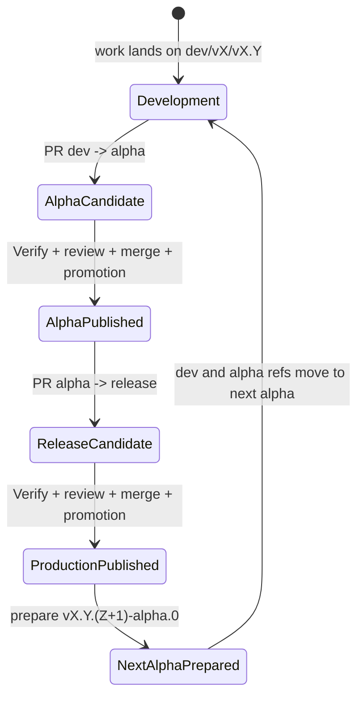
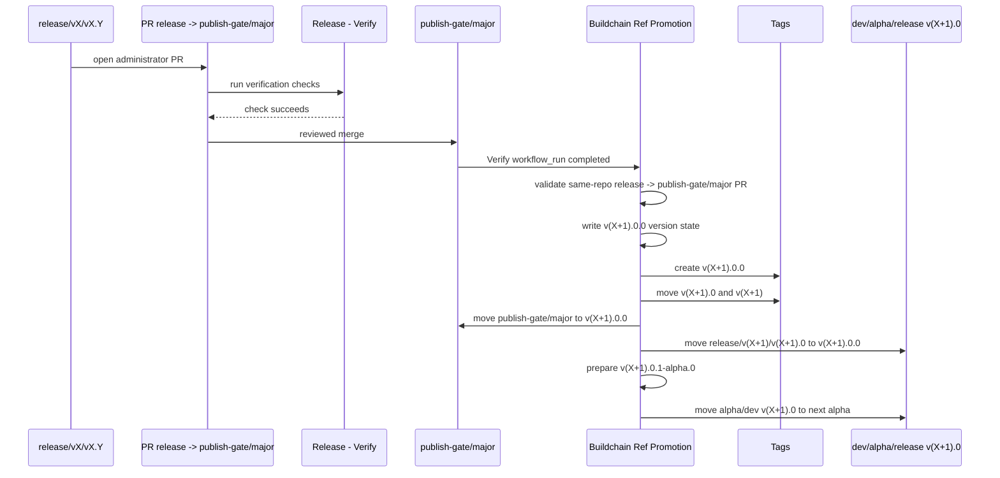

# Release Flow Diagrams

This document describes v4 alpha publication and the legacy v3 release flow.
See [Release governance](release-governance.md) for the design rationale.

## Architecture



Buildchain treats the PR merge as release intent and the promotion action as the
only component allowed to turn that intent into release refs.

`StableGate` applies only to Buildchain's release channel. Alpha and train
iteration bypass it. See [Stable Release Throttle And Canary Gate](release-governance.md#stable-release-throttle-and-canary-gate)
for the versioned policy and evidence contract.

## Ref State

| Ref kind | Example | Mutability | Purpose |
| --- | --- | --- | --- |
| Development branch | `dev/v4/v4.0` | moves | next source state for a minor line |
| Alpha branch | `alpha/v4/v4.0` | moves | latest test state for a minor line |
| Release branch | `release/v4/v4.0` | moves | latest production state for a minor line |
| Major gate branch | `publish-gate/major` | moves | reviewed administrator gate for publishing the next major |
| Exact alpha tag | `v4.0.3-alpha.0` | immutable | audit ref for one tested prerelease |
| Exact release tag | `v4.0.2` | immutable | audit ref for one production release |
| Floating alpha tag | `v4.0-alpha` | moves | latest test channel for a minor line |
| Floating major alpha tag | `v4-alpha` | moves | latest test channel on the highest published alpha minor for a major line |
| Floating minor tag | `v4.0` | moves | latest production patch on a minor line |
| Floating major tag | `v4` | moves | selected stable major entrypoint |

## Ref Protection Contract

Repository rulesets must distinguish immutable evidence refs from mutable
channel refs.

Protect exact release and alpha tags as immutable evidence:

```text
refs/tags/v*.*.*
```

Do not apply immutable-tag rulesets to every `refs/tags/v*` ref. Buildchain
must be able to update floating channel tags such as `v4`, `v4.0`, `v4.0-alpha`,
and `v4-alpha` after the exact tag and publish evidence are valid. A ruleset that
matches all `v*` tags also matches floating tags, so release finalization can
fail with GitHub protected-ref errors even though the exact release tag and
published artifacts are already durable.

The intended governance split is:

- exact tags such as `v4.0.2` and `v4.0.3-alpha.0` are immutable audit refs;
- for publish transactions, the exact tag points to the transaction
  `source_sha`, matching package-registry source metadata such as npm
  `gitHead`; generated version-state commits remain on protected branches and
  floating channel refs;
- floating tags such as `v4`, `v4.0`, `v4.0-alpha`, and `v4-alpha` are mutable channel refs
  owned by the Buildchain promotion token;
- protected branches still require reviewed channel PRs before Buildchain can
  move any exact or floating release refs.

## Opening a Minor Line

New minor lines should be opened through Buildchain instead of hand-created
branches. The reusable entrypoint is the `Release Line Bootstrap` workflow. It
defaults to dry-run so maintainers can inspect the planned refs, protection
contract, initial version, and first alpha PR before any mutation.

The workflow is backed by the CLI command:

```bash
buildchain release line open \
  --major 4 \
  --minor 1 \
  --source-ref release/v4/v4.0 \
  --json
```

When the workflow is run with `apply=true`, Buildchain:

- writes the initial version-state commit, such as `4.1.0-alpha.0`;
- creates `dev/v4/v4.1` from that commit;
- creates `alpha/v4/v4.1` and `release/v4/v4.1` from the selected source ref;
- applies branch protection with one approving review and the configured
  required status check; dev starts strict, while alpha and release also require
  the pair-specific `verify` aggregate without a source-up-to-date ancestry loop;
- reconciles the new dev branch's explicitly declared merge queue, or inherits
  the exact queue parameters and bypass actors from the current default dev
  branch when the policy is `inherit` or absent;
- switches the repository default branch to the new dev line when requested;
- opens the first `dev/v4/v4.1 -> alpha/v4/v4.1` channel PR when requested.

This makes minor-line creation a single audited operation. The channel PR still
goes through the normal verify/review/promotion path before an alpha is
published. Queue reconciliation runs after branch protection and before the
default-branch switch, so a failed governance apply leaves the old active line
in place and the idempotently created new refs can be retried.

## V4 Alpha Publication

The protected `dev/v4/v4.0 -> alpha/v4/v4.0` channel PR admits the source.
Publication creates the immutable `v4.0.Z-alpha.N` tag and advances the eligible
floating alpha refs to that published source. Its completed receipt and original
Release Passport remain the publication authority.

A separate protected next-development PR prepares `4.0.Z-alpha.(N+1)` on
`dev/v4/v4.0`. Preparing that version does not publish another exact tag or move
the alpha refs. A review, queue, or transient API failure in that PR leaves
publication complete and next-development incomplete; recovery resumes the
missing tail. Binary distribution has its own evidence and completion state.
See [What each verification proves](#what-each-verification-proves).

## Legacy V3 Alpha Promotion



Result:

```text
vX.Y.Z-alpha.N
vX.Y-alpha
vX-alpha when X.Y is the highest published alpha minor
alpha/vX/vX.Y
dev/vX/vX.Y
```

all point at the generated alpha version-state commit.

## Legacy V3 Release Promotion



Result:

```text
vX.Y.Z
vX.Y
vX
release/vX/vX.Y
```

point at the production version-state commit, while:

```text
vX.Y.(Z+1)-alpha.0
vX.Y-alpha
vX-alpha when X.Y is the highest published alpha minor
alpha/vX/vX.Y
dev/vX/vX.Y
```

point at the next alpha version-state commit.

## Legacy V3 State Machine



The same minor line can loop through this state machine many times.

## Legacy V3 Version Examples

Assume `v3.0.2-alpha.1` has been tested and a maintainer merges
`alpha/v3/v3.0 -> release/v3/v3.0`.

Buildchain should produce:

```text
v3.0.2                  exact production tag
v3.0                    floating minor tag
v3                      floating major tag when v3.0 is the selected major line
release/v3/v3.0         production channel branch
```

It should also prepare:

```text
v3.0.3-alpha.0          exact next alpha tag
v3.0-alpha              floating alpha tag
v3-alpha                floating major alpha tag when v3.0 is the highest published alpha minor
alpha/v3/v3.0           alpha channel branch
dev/v3/v3.0             development channel branch
```

This is expected behavior. A production release closes one patch and opens the
next test patch on the same minor line.

## Major Gate Promotion



`publish-gate/major` is intentionally not an active source branch. It is the PR
target for the administrator's "publish the next major" decision. The older
`major-gate` name is a compatibility alias only.

## Failure Boundaries

Promotion should stop before moving refs when:

- the run is a non-dry-run manual dispatch;
- the expected same-repository PR cannot be found;
- the PR was not merged;
- the branch pair is not a valid channel path;
- the required status check did not pass;
- a release tree does not match the same-patch alpha tag tree, except for the
  declared anchored/manual version files and anchor manifest that
  `lifecycle.verify` or `verification-command` validates;
- version-state verification fails;
- a required exact tag already exists at a commit unrelated to the active
  transaction or finalized channel head.

These failures are intentional. They protect consumers from refs that look
released but do not have a complete evidence chain.

During transaction finalization recovery, the current channel head may be a
generated version-state merge commit. Buildchain validates that the durable
transaction version, exact tag, evidence, and release material match, and that
the current target ref contains or corresponds to the recorded
`release_material_sha`. It must then tolerate exact tags, dev refs, or alpha
refs that have already moved and continue filling any missing floating tags
before writing the transaction state as `complete`.

## What each verification proves

| Evidence | Meaning and reuse boundary |
| --- | --- |
| Full source execution | `pnpm run check` runs source tests, Rust gates, policy checks and generated artifact checks. Each Node test file runs once; the focused `check:v4-contracts` command still includes its 22 contract test files. |
| Merge queue proof | A successful full merge-group run seals its exact source SHA/tree, workflow, check definition, WASM runtime, toolchain versions, dependency locks, hosted image and platform. The proof expires after six hours and is verified against the completed GitHub run attempt and artifact archive digest. |
| Push reuse | A Dev push may reuse that exact full execution. Its summary links the original run and proof; it does not claim to have rerun tests. Missing, failed, expired, ambiguous, tampered or unavailable evidence executes the full check. |
| Version-state projection | Requires an authenticated full-source proof for the exact base and an ancestor-bound delta containing only declared version files and derived material. The base generator reconstructs every tracked byte, including derived digests. Any source, workflow, lock, configuration, file-mode or unexplained output change executes the full check. Projection results cannot issue a new full-source proof. |
| Generated version-state check | `Version-state projection / <context>` describes generated material. It never uses a protected full-source check's name on v4. Required PR lineage, review and merge queue gates remain independent. |
| Candidate qualification | Validates the sealed candidate, admitted runtime, source lock and publication authority. Source test reuse grants no provider mutation authority. |
| Provider readback and settlement | Verifies actual tags, npm integrity, release assets and native receipt roots. Publication, next-development and binary distribution are reported separately. |

The protected `check` context keeps its stable name while step names and summaries
identify full execution, exact proof reuse, or generated projection. The two
consumer-policy checks execute inside the root check, without duplicate Verify
pre-steps. The root check uses the Rust-only contract command before its complete
Node suite, removing 22 repeated test-file executions without removing tests.

The public v4 consumer remains a thin floating-channel caller with both locks.
Linux, macOS and Windows each execute the declared lifecycle, clean-process
restore and runtime/source binding. Their platform and called-runtime identities
differ from the source Verify lane, so a Linux source proof cannot replace them.
The Stage Capsule checkpoint matrix also retains all three platforms. Shared
platform-independent logic lives in the root check and public runtime; there is
no Buildchain-only dogfood exception or persisted candidate runtime selector.

A local Linux sample on 2026-09-05 measured the original full check at
`a41c00a0c0b2dbd57c238cd9b326b167a1d27ca8` at 148.772 seconds and the updated check
at 126.731 seconds, both exit 0. The original plan executed 226 Node test files
plus 22 duplicate selections; the updated plan executes all 231 files once,
including the new negative and recovery tests (2,047 tests). These are individual
local measurements with existing tool caches; hosted queue/push reuse is proved
separately by the exact run attempt and evidence roots in each job summary.
