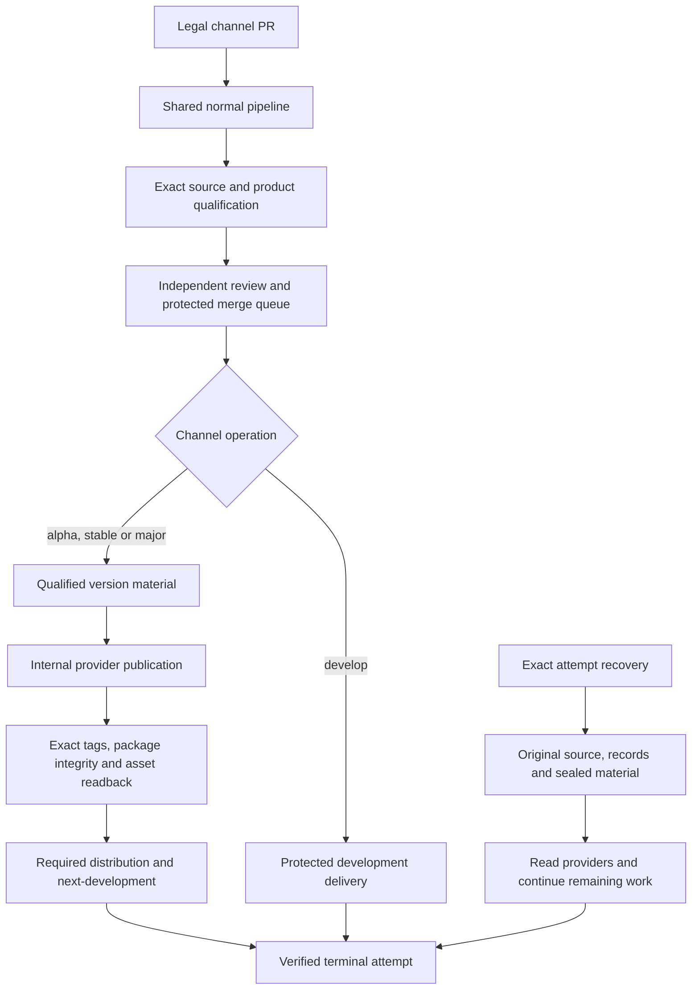

# Release Flow Diagrams

Consumers express intent through a legal channel PR. The generated normal entry
owns delivery and publication; the generated recovery entry resumes an exact
attempt. See [Release governance](release-governance.md).

## Architecture

This is an ownership diagram; exact stage dependencies belong to the runtime.
The consumer does not dispatch each node or pass state between them. Product
commands and artifact declarations are in TOML; provider effects and receipts
are internal.

## Ref State

| Ref kind | Example | Purpose |
| --- | --- | --- |
| Development branch | `dev/v4/v4.1` | reviewed source for the minor line |
| Alpha branch | `alpha/v4/v4.1` | prerelease channel |
| Release branch | `release/v4/v4.1` | stable channel |
| Major gate branch | `publish-gate/major` | reviewed next-major intent |
| Exact alpha tag | `v4.1.4-alpha.1` | immutable prerelease identity |
| Exact stable tag | `v4.1.3` | immutable stable identity |
| Floating alpha refs | `v4.1-alpha`, `v4-alpha` | published prerelease channel |
| Floating stable refs | `v4.1`, `v4` | published stable channel |

Examples illustrate ref shapes, not current provider observations. Tool-maintained
locks bind qualified runtime identities separately from the source being built.

## Ref Protection Contract

Exact release and alpha tags are immutable evidence. Mutable channel refs must
remain distinguishable from exact tags in repository rules. A blanket immutable
rule matching every `v*` tag would also prevent intended floating-channel updates.

Protected branch movement remains subject to declared reviews and checks.
Publication authority validates the recorded source/material identity before
creating or advancing refs. An already-published immutable ref or asset cannot
be overwritten to make a new attempt appear successful.

## Alpha and stable publication

A development-to-alpha PR requests a fresh prerelease. An alpha-to-release PR
requests stable publication. The selected runtime qualifies the source,
materializes the version and publishes the declared products. Stable additionally
checks its version-bound policy and published-entry evidence before publication.
Buildchain's current minimum interval and soak are zero; see the
[Stable Release Evidence Gate](release-governance.md#stable-release-evidence-gate).

Next-development is a follow-up with its own evidence. Stable completion prepares
the next patch at `alpha.0` from the current protected development source without
losing concurrent changes. Its [contract](next-development-transition.md) owns
retry, source preservation and protected landing.

## Major Gate Promotion

`release/vX/vX.Y -> publish-gate/major` expresses the next-major decision through
the same reviewable PR interface. It does not add a consumer workflow, manual
provider command or separate product-specific publish controller.

## Failure Boundaries

Missing or stale source authority, failed product verification, missing review,
invalid branch pairs, ambiguous provider state and immutable collisions block
the affected stage. Recovery uses the exact attempt and retained material.
An optional repaired runtime changes execution implementation, not historical
source, already-published bytes or receipt ownership.

The two public entries do not expose Discussion/run/transaction selector
combinations. A new version is a new publication. Old failed versions can remain
historical without being repaired or republished.

## What each verification proves

| Evidence | Meaning |
| --- | --- |
| Local repository checks | source tests and generated consistency for the checked worktree |
| Hosted source/platform qualification | exact source/runtime and required platform results |
| Independent review and merge queue | protected landing of the admitted candidate |
| Version material verification | declared version material agrees with its qualified source |
| Provider readback | actual package, tags and Release assets agree with publication evidence |
| Follow-up receipts | required distribution and next-development outcomes |
| Terminal attempt | all required stages have verified terminal evidence |

No earlier row substitutes for a later one. Reused proof must retain its original
source and execution identity; a projection must not claim it reran a build.
See [release discussions](release-discussions.md) for immutable attempt records.
